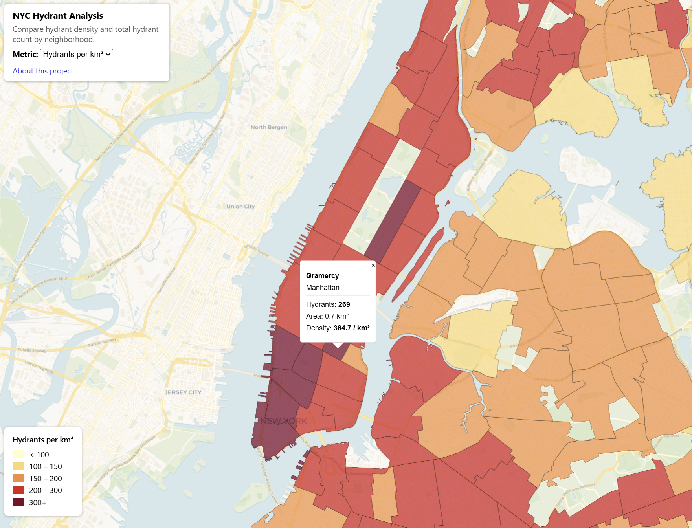

# NYC Hydrant Density Map

🗺️ **[Live map](https://sarah-antonelli.github.io/nyc-hydrant-map/)**

A web map showing NYC fire hydrant density and total count by neighborhood. Built using MapLibre, PMTiles, and GitHub Pages for free.



## The question

Where is hydrant coverage densest in NYC, and which neighborhoods are underserved relative to their area?

## The data

- **NYC Neighborhoods.** 262 polygons (Source: [NYC Open Data](https://opendata.cityofnewyork.us))
- **NYC Fire Hydrants.** 109,725 points (Source: [NYC Open Data](https://opendata.cityofnewyork.us))
- Density was computed using PostGIS and GeoPandas and can be found at this [repo](https://github.com/sarah-antonelli/nyc-hydrant-analysis)

## The technology choices

- **MapLibre GL JS** for rendering. Open-source, no vendor lock-in, same API as Mapbox GL JS.
- **PMTiles** for the data layer. One file, no tile server, hosted alongside `index.html` and 'about.html' on GitHub Pages.
- **tippecanoe** for tile generation. Polygon recipe with shared-border detection for clean rendering at all zooms.
- **GitHub Pages** for hosting. Free, fast, no infrastructure to maintain.

## How to reproduce

Requires GDAL, tippecanoe, and a tiny local web server.

```bash
git clone https://github.com/{your-username}/nyc-hydrant-map.git
cd nyc-hydrant-map


# Rebuild the .pmtiles
./create_pmtiles.sh
```

### Test locally

PMTiles requires HTTP Range requests for efficient tile access.

```bash
pip install rangehttpserver
python -m RangeHTTPServer 8000
```

Open:

http://localhost:8000

## What I learned

The most challenging part of this project was debugging local PMTiles hosting, since the map required HTTP Range requests and did not work correctly with Python's default web server. Once the core map was functioning, adding new features and polish was surprisingly fast. AI assistants were especially useful for refining legends, styling, and frontend functionality, making it easy to iterate on the user experience while keeping the focus on geospatial design and analysis.

## Stack

- MapLibre GL JS 4.5.2
- PMTiles 3.2.0
- tippecanoe (felt fork)
- GitHub Pages
